A Case Study on Retail Giant Sales/Demand Time Series Forecasting :
===================================================================

------------------------------------------------------------------------

**Objective:**
Identify top 2 consistently profitable market segments of Global Mart and forecast Sales & Demand for next 6 months in those Market Segments using Time Series Analysis

Business understanding
----------------------

Global Mart is an online store super giant having worldwide operations. The store caters to 7 different geographies(Markets) and in 3 major segments. The goal is to identify top 2 consistently profitable market segments of Global Mart and forecast Sales & Demand for next 6 months in those Market Segments using Time Series Analysis

*Installing & Loading required packages* Check and Import required libraries

``` r
options(warn = -1)
libs = c("tidyverse", "lubridate", "graphics", "forecast", "tseries")
install.lib <- libs[!libs %in% installed.packages()]
for (pkg in install.lib)
  install.packages(pkg, dependencies = T)
loadlib     <- lapply(libs, library, character.only = T) # load them
```

    ## -- Attaching packages -------------------------------------------------------- tidyverse 1.2.1 --

    ## v ggplot2 2.2.1     v purrr   0.2.4
    ## v tibble  1.4.2     v dplyr   0.7.4
    ## v tidyr   0.8.0     v stringr 1.3.0
    ## v readr   1.1.1     v forcats 0.3.0

    ## -- Conflicts ----------------------------------------------------------- tidyverse_conflicts() --
    ## x dplyr::filter() masks stats::filter()
    ## x dplyr::lag()    masks stats::lag()

    ## 
    ## Attaching package: 'lubridate'

    ## The following object is masked from 'package:base':
    ## 
    ##     date

``` r
remove(list = ls())
options(warn = 0)
```

*Import Dataset*

``` r
superstore <-  read.csv("Global Superstore.csv", stringsAsFactors = F)
```

Data Understanding
------------------

``` r
dim(superstore)
```

    ## [1] 51290    24

``` r
glimpse(superstore)
```

    ## Observations: 51,290
    ## Variables: 24
    ## $ Row.ID         <int> 32298, 26341, 25330, 13524, 47221, 22732, 30570...
    ## $ Order.ID       <chr> "CA-2012-124891", "IN-2013-77878", "IN-2013-712...
    ## $ Order.Date     <chr> "31-07-2012", "05-02-2013", "17-10-2013", "28-0...
    ## $ Ship.Date      <chr> "31-07-2012", "07-02-2013", "18-10-2013", "30-0...
    ## $ Ship.Mode      <chr> "Same Day", "Second Class", "First Class", "Fir...
    ## $ Customer.ID    <chr> "RH-19495", "JR-16210", "CR-12730", "KM-16375",...
    ## $ Customer.Name  <chr> "Rick Hansen", "Justin Ritter", "Craig Reiter",...
    ## $ Segment        <chr> "Consumer", "Corporate", "Consumer", "Home Offi...
    ## $ City           <chr> "New York City", "Wollongong", "Brisbane", "Ber...
    ## $ State          <chr> "New York", "New South Wales", "Queensland", "B...
    ## $ Country        <chr> "United States", "Australia", "Australia", "Ger...
    ## $ Postal.Code    <int> 10024, NA, NA, NA, NA, NA, NA, NA, 95823, 28027...
    ## $ Market         <chr> "US", "APAC", "APAC", "EU", "Africa", "APAC", "...
    ## $ Region         <chr> "East", "Oceania", "Oceania", "Central", "Afric...
    ## $ Product.ID     <chr> "TEC-AC-10003033", "FUR-CH-10003950", "TEC-PH-1...
    ## $ Category       <chr> "Technology", "Furniture", "Technology", "Techn...
    ## $ Sub.Category   <chr> "Accessories", "Chairs", "Phones", "Phones", "C...
    ## $ Product.Name   <chr> "Plantronics CS510 - Over-the-Head monaural Wir...
    ## $ Sales          <dbl> 2309.650, 3709.395, 5175.171, 2892.510, 2832.96...
    ## $ Quantity       <int> 7, 9, 9, 5, 8, 5, 4, 6, 5, 13, 5, 5, 4, 7, 12, ...
    ## $ Discount       <dbl> 0.0, 0.1, 0.1, 0.1, 0.0, 0.1, 0.0, 0.0, 0.2, 0....
    ## $ Profit         <dbl> 762.1845, -288.7650, 919.9710, -96.5400, 311.52...
    ## $ Shipping.Cost  <dbl> 933.57, 923.63, 915.49, 910.16, 903.04, 897.35,...
    ## $ Order.Priority <chr> "Critical", "Critical", "Medium", "Medium", "Cr...

``` r
head(superstore)
```

    ##   Row.ID        Order.ID Order.Date  Ship.Date    Ship.Mode Customer.ID
    ## 1  32298  CA-2012-124891 31-07-2012 31-07-2012     Same Day    RH-19495
    ## 2  26341   IN-2013-77878 05-02-2013 07-02-2013 Second Class    JR-16210
    ## 3  25330   IN-2013-71249 17-10-2013 18-10-2013  First Class    CR-12730
    ## 4  13524 ES-2013-1579342 28-01-2013 30-01-2013  First Class    KM-16375
    ## 5  47221    SG-2013-4320 05-11-2013 06-11-2013     Same Day     RH-9495
    ## 6  22732   IN-2013-42360 28-06-2013 01-07-2013 Second Class    JM-15655
    ##      Customer.Name     Segment          City           State       Country
    ## 1      Rick Hansen    Consumer New York City        New York United States
    ## 2    Justin Ritter   Corporate    Wollongong New South Wales     Australia
    ## 3     Craig Reiter    Consumer      Brisbane      Queensland     Australia
    ## 4 Katherine Murray Home Office        Berlin          Berlin       Germany
    ## 5      Rick Hansen    Consumer         Dakar           Dakar       Senegal
    ## 6      Jim Mitchum   Corporate        Sydney New South Wales     Australia
    ##   Postal.Code Market  Region       Product.ID   Category Sub.Category
    ## 1       10024     US    East  TEC-AC-10003033 Technology  Accessories
    ## 2          NA   APAC Oceania  FUR-CH-10003950  Furniture       Chairs
    ## 3          NA   APAC Oceania  TEC-PH-10004664 Technology       Phones
    ## 4          NA     EU Central  TEC-PH-10004583 Technology       Phones
    ## 5          NA Africa  Africa TEC-SHA-10000501 Technology      Copiers
    ## 6          NA   APAC Oceania  TEC-PH-10000030 Technology       Phones
    ##                                                         Product.Name
    ## 1 Plantronics CS510 - Over-the-Head monaural Wireless Headset System
    ## 2                          Novimex Executive Leather Armchair, Black
    ## 3                                  Nokia Smart Phone, with Caller ID
    ## 4                                     Motorola Smart Phone, Cordless
    ## 5                                     Sharp Wireless Fax, High-Speed
    ## 6                                Samsung Smart Phone, with Caller ID
    ##      Sales Quantity Discount    Profit Shipping.Cost Order.Priority
    ## 1 2309.650        7      0.0  762.1845        933.57       Critical
    ## 2 3709.395        9      0.1 -288.7650        923.63       Critical
    ## 3 5175.171        9      0.1  919.9710        915.49         Medium
    ## 4 2892.510        5      0.1  -96.5400        910.16         Medium
    ## 5 2832.960        8      0.0  311.5200        903.04       Critical
    ## 6 2862.675        5      0.1  763.2750        897.35       Critical

``` r
tail(superstore)
```

    ##       Row.ID       Order.ID Order.Date  Ship.Date      Ship.Mode
    ## 51285  24175  IN-2014-57662 05-08-2014 10-08-2014 Standard Class
    ## 51286  29002  IN-2014-62366 19-06-2014 19-06-2014       Same Day
    ## 51287  35398 US-2014-102288 20-06-2014 24-06-2014 Standard Class
    ## 51288  40470 US-2013-155768 02-12-2013 02-12-2013       Same Day
    ## 51289   9596 MX-2012-140767 18-02-2012 22-02-2012 Standard Class
    ## 51290   6147 MX-2012-134460 22-05-2012 26-05-2012   Second Class
    ##       Customer.ID     Customer.Name     Segment       City      State
    ## 51285    DB-13270 Deborah Brumfield Home Office Townsville Queensland
    ## 51286    KE-16420   Katrina Edelman   Corporate       Kure  Hiroshima
    ## 51287    ZC-21910  Zuschuss Carroll    Consumer    Houston      Texas
    ## 51288    LB-16795    Laurel Beltran Home Office     Oxnard California
    ## 51289    RB-19795        Ross Baird Home Office   Valinhos  São Paulo
    ## 51290    MC-18100     Mick Crebagga    Consumer   Tipitapa    Managua
    ##             Country Postal.Code Market     Region      Product.ID
    ## 51285     Australia          NA   APAC    Oceania OFF-BI-10002424
    ## 51286         Japan          NA   APAC North Asia OFF-FA-10000746
    ## 51287 United States       77095     US    Central OFF-AP-10002906
    ## 51288 United States       93030     US       West OFF-EN-10001219
    ## 51289        Brazil          NA  LATAM      South OFF-BI-10000806
    ## 51290     Nicaragua          NA  LATAM    Central OFF-PA-10004155
    ##              Category Sub.Category
    ## 51285 Office Supplies      Binders
    ## 51286 Office Supplies    Fasteners
    ## 51287 Office Supplies   Appliances
    ## 51288 Office Supplies    Envelopes
    ## 51289 Office Supplies      Binders
    ## 51290 Office Supplies        Paper
    ##                                                                     Product.Name
    ## 51285                                                      Avery Binder, Economy
    ## 51286                                              Advantus Thumb Tacks, 12 Pack
    ## 51287 Hoover Replacement Belt for Commercial Guardsman Heavy-Duty Upright Vacuum
    ## 51288                               #10- 4 1/8" x 9 1/2" Security-Tint Envelopes
    ## 51289                                                    Acco Index Tab, Economy
    ## 51290                                    Eaton Computer Printout Paper, 8.5 x 11
    ##        Sales Quantity Discount  Profit Shipping.Cost Order.Priority
    ## 51285 58.050        5      0.1 19.9500          0.01         Medium
    ## 51286 65.100        5      0.0  4.5000          0.01         Medium
    ## 51287  0.444        1      0.8 -1.1100          0.01         Medium
    ## 51288 22.920        3      0.0 11.2308          0.01           High
    ## 51289 13.440        2      0.0  2.4000          0.00         Medium
    ## 51290 61.380        3      0.0  1.8000          0.00           High

Checking for duplicates

``` r
length(unique(superstore$Row.ID)) != dim(superstore)[1]
```

    ## [1] FALSE

51290 IDs matches with 51290 total observations. So no duplicates

Checking for NA values

``` r
anyNA(superstore)
```

    ## [1] TRUE

Looks like there are NA Values. Lets check which columns have NAs

``` r
colSums(is.na(superstore))
```

    ##         Row.ID       Order.ID     Order.Date      Ship.Date      Ship.Mode 
    ##              0              0              0              0              0 
    ##    Customer.ID  Customer.Name        Segment           City          State 
    ##              0              0              0              0              0 
    ##        Country    Postal.Code         Market         Region     Product.ID 
    ##              0          41296              0              0              0 
    ##       Category   Sub.Category   Product.Name          Sales       Quantity 
    ##              0              0              0              0              0 
    ##       Discount         Profit  Shipping.Cost Order.Priority 
    ##              0              0              0              0

Postal Code has 41296 NA Values. We will not treat these, since we are not interested in this column for this case study.

Attributes of interest for this case study

1.  Order Date - Date on which the order was placed
2.  Market - The Market segment to which the customer belongs
3.  Segment - The market segment to which the product belongs
4.  Sales - Total sales value of the transaction
5.  Quantity - Quantity of the product ordered
6.  Profit - Profit made on the transaction

Data Preparation & EDA
----------------------

Convert order date into correct date format Add a new derived column which will have Year, Month values from Order date

``` r
superstore <- superstore %>%
   mutate(Order.Date  = dmy(Order.Date), 
          Order.YearMon = format(Order.Date, "%Y-%m"))
          
table(superstore$Market)
```

    ## 
    ## Africa   APAC Canada   EMEA     EU  LATAM     US 
    ##   4587  11002    384   5029  10000  10294   9994

``` r
table(superstore$Segment)
```

    ## 
    ##    Consumer   Corporate Home Office 
    ##       26518       15429        9343

``` r
table(superstore$Market, superstore$Segment)
```

    ##         
    ##          Consumer Corporate Home Office
    ##   Africa     2381      1312         894
    ##   APAC       5699      3283        2020
    ##   Canada      202       110          72
    ##   EMEA       2538      1574         917
    ##   EU         5186      3077        1737
    ##   LATAM      5321      3053        1920
    ##   US         5191      3020        1783

7 Markets and 3 segments. Total of 21 Market segments

Aggregate sum of Sales, Profit, Quantity month on month

``` r
mrkt_seg_grp <-  superstore %>% 
  group_by(Market, Segment, Order.YearMon) %>% 
  summarise(Profit = sum(Profit, na.rm = T), 
            Sales = sum(Sales, na.rm = T),
            Quantity = sum(Quantity, na.rm = T)) 
```

Create list of dataframe subsets for each of the 21 Market segments Columns selected in each dataframe - Sales, Profit, Quantity and YearMonth

``` r
mrkt_seg <-  split(mrkt_seg_grp, list(mrkt_seg_grp$Market, 
                                          mrkt_seg_grp$Segment))
```

Names of market segments

``` r
names(mrkt_seg)
```

    ##  [1] "Africa.Consumer"    "APAC.Consumer"      "Canada.Consumer"   
    ##  [4] "EMEA.Consumer"      "EU.Consumer"        "LATAM.Consumer"    
    ##  [7] "US.Consumer"        "Africa.Corporate"   "APAC.Corporate"    
    ## [10] "Canada.Corporate"   "EMEA.Corporate"     "EU.Corporate"      
    ## [13] "LATAM.Corporate"    "US.Corporate"       "Africa.Home Office"
    ## [16] "APAC.Home Office"   "Canada.Home Office" "EMEA.Home Office"  
    ## [19] "EU.Home Office"     "LATAM.Home Office"  "US.Home Office"

``` r
length(mrkt_seg)
```

    ## [1] 21

Out of 21 market buckets lets identify the top 2 profitable ones i.e our objective is to focus on the 2 most consistently profitable segments For this we will use Coefficent of Variance (COV) metric to compare against the segments.

**Coefficent of Variance - ratio of the standard deviation to the mean**

``` r
mkt_seg_profits <- data.frame()
for (i in 1:length(mrkt_seg)) {
  mkt_seg_profits[i, "seg_name"]   <- names(mrkt_seg[i])
  mkt_seg_profits[i, "avg_profit"] <- round(mean(mrkt_seg[[i]]$Profit), 2)
  mkt_seg_profits[i, "cov_profit"] <- 
    round(sd(mrkt_seg[[i]]$Profit)/mkt_seg_profits[i, "avg_profit"], 2)
}
```

Setting the theme for ggplots

``` r
plot_theme <- theme_classic() + 
  theme(plot.title = element_text(hjust = 0.5, size = 12,face = 'bold'),
        axis.title.x = element_text(size = 12),
        axis.title.y = element_text(size = 12),
        axis.text.x  = element_text(size = 10),
        axis.text.y  = element_text(size = 10))
```

Analysing the average profits

``` r
mkt_seg_profits %>% arrange(desc(avg_profit))
```

    ##              seg_name avg_profit cov_profit
    ## 1       APAC.Consumer    4642.03       0.63
    ## 2         EU.Consumer    3930.99       0.62
    ## 3         US.Consumer    2794.15       1.01
    ## 4      APAC.Corporate    2702.86       0.70
    ## 5        EU.Corporate    2570.71       0.76
    ## 6      LATAM.Consumer    2513.19       0.66
    ## 7        US.Corporate    1916.23       1.00
    ## 8    APAC.Home Office    1738.44       1.05
    ## 9      EU.Home Office    1265.58       1.12
    ## 10     US.Home Office    1256.22       1.10
    ## 11    LATAM.Corporate    1205.74       0.81
    ## 12    Africa.Consumer     995.25       1.32
    ## 13  LATAM.Home Office     898.65       1.18
    ## 14      EMEA.Consumer     531.93       2.19
    ## 15   Africa.Corporate     430.98       1.78
    ## 16 Africa.Home Office     425.26       1.79
    ## 17     EMEA.Corporate     260.40       4.47
    ## 18    Canada.Consumer     230.42       1.40
    ## 19   Canada.Corporate     148.13       1.55
    ## 20 Canada.Home Office     124.13       2.24
    ## 21   EMEA.Home Office     122.21       5.88

Plotting Average profits

``` r
mkt_seg_profits %>% 
  ggplot(aes(x = seg_name, y = avg_profit)) + 
  geom_col() +
  geom_text(aes(label = avg_profit), hjust = -0.15, size = 3.5) + 
  scale_y_continuous(expand = c(0, 0), limits = c(0, 5000)) + 
  geom_col(data = mkt_seg_profits %>% filter(avg_profit > 3800), 
           col = "#F8766D", fill = "#00BA38") + 
  labs(x = "Market Segments ",  y = "Monthly Average Profit", 
       title = "Monthly Average Profit by Market Segments") + 
  plot_theme + 
  coord_flip() 
```

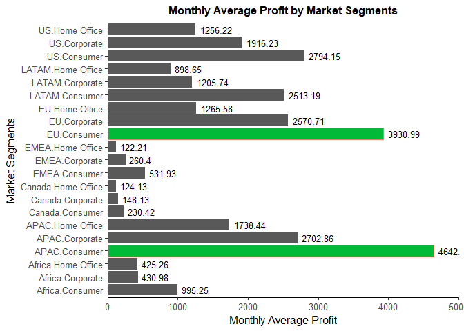

Analysing Coefficent of Variance

``` r
mkt_seg_profits %>% arrange(cov_profit)
```

    ##              seg_name avg_profit cov_profit
    ## 1         EU.Consumer    3930.99       0.62
    ## 2       APAC.Consumer    4642.03       0.63
    ## 3      LATAM.Consumer    2513.19       0.66
    ## 4      APAC.Corporate    2702.86       0.70
    ## 5        EU.Corporate    2570.71       0.76
    ## 6     LATAM.Corporate    1205.74       0.81
    ## 7        US.Corporate    1916.23       1.00
    ## 8         US.Consumer    2794.15       1.01
    ## 9    APAC.Home Office    1738.44       1.05
    ## 10     US.Home Office    1256.22       1.10
    ## 11     EU.Home Office    1265.58       1.12
    ## 12  LATAM.Home Office     898.65       1.18
    ## 13    Africa.Consumer     995.25       1.32
    ## 14    Canada.Consumer     230.42       1.40
    ## 15   Canada.Corporate     148.13       1.55
    ## 16   Africa.Corporate     430.98       1.78
    ## 17 Africa.Home Office     425.26       1.79
    ## 18      EMEA.Consumer     531.93       2.19
    ## 19 Canada.Home Office     124.13       2.24
    ## 20     EMEA.Corporate     260.40       4.47
    ## 21   EMEA.Home Office     122.21       5.88

Plotting Coefficent of Variance

``` r
mkt_seg_profits %>% 
 ggplot(aes(x = seg_name, y = cov_profit)) + 
  geom_col() +   
  geom_text(aes(label = cov_profit), hjust = -0.15, size = 3.5) +
  scale_y_continuous(expand = c(0, 0), limits = c(0, 6))  + 
  geom_col(data = mkt_seg_profits %>% filter(cov_profit <= 0.63), 
           col = "#F8766D", fill = "#00BA38") + 
  labs(x = "Market Segments ",  y = "Coefficient of Variation", 
       title = "Coefficient of Variation on Profits by Market Segments") + 
  plot_theme + 
  coord_flip() 
```

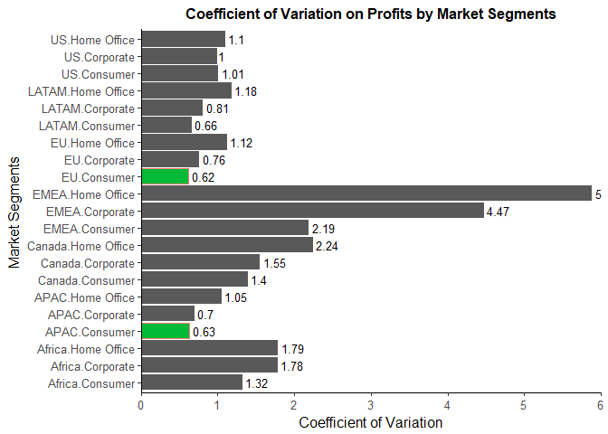

Both COV and average profits indicate that the most profitable market segments to be:

-   APAC consumer
-   EA Consumer

*Summary :* APAC consumer and EA Consumer market segments has the least Coefficient of Variance metric
indicating that these are the consistently performing market segments in terms of profits. We will focus on these market segments during model building, evaluating and forecasting stages.

``` r
top_profitable_mrkt_seg <- c("EU.Consumer","APAC.Consumer")
```

EDA on top profitable time series
---------------------------------

Create individual dataframes for top\_profitable\_mrkt\_seg from the mrkt\_seg list

``` r
list2env(mrkt_seg[top_profitable_mrkt_seg] ,.GlobalEnv)
```

    ## <environment: R_GlobalEnv>

Function to explore the 4 market segments timeseries

``` r
exploreTS <- function(var, segname, varname){
    par(ask = T)
    print(paste("Exploratory data analysis on", segname, ":", varname))
    
    # Convert data to a time series 
    timeseries <- ts(var, start = 2011, frequency = 12)
    
    print(class(timeseries))    # Tells that the data is in a 
                                # time series format
    print(start(timeseries))    # This is the start of the time series
    print(end(timeseries))      # This is the end of the time series
    print(frequency(timeseries))# The cycle of this time series is
                                # 12 months in a year
    print(summary(timeseries))  
    op <- par(mfrow = c(2,2), oma = c(0,0,2,0), mar = rep(2, 4))
    
    plot(timeseries, main = "Timeseries with trend line")
    
    abline(reg = lm(timeseries~time(timeseries))) # This will fit in a line
    
    print(cycle(timeseries)) # This will print the cycle across years.
    
    # This will aggregate the cycles and display a year on year trend
    plot(aggregate(timeseries, FUN = mean),
        main = "Year on Year trend based on average Sales",
        ylab = paste("Average", varname))
    
    # Box plot across months will give us a sense on seasonal effect
    boxplot(timeseries~cycle(timeseries), main = "Box plot across months", 
            xlab = "Month", ylab = paste("Average", varname))
    
    # Sesonal plot plot across months  
    seasonplot(timeseries, year.labels = T, year.labels.left = T,
                col = 1:4, ylab = paste("Average", varname))
    title(paste("Exploratory data analysis on", segname, ":", varname),
          outer = TRUE)
    
    par(oma = c(0,0,1,0))

    # Visualize timeseries by decomposing the trend, seasonal & random noise 
    # componenets
    plot(decompose(timeseries))
    title(paste(segname, ":", varname),
          outer = TRUE)
    par(op)
    par(ask = F)
}

for (i in top_profitable_mrkt_seg) {
  segname <- paste(unique(mrkt_seg[[i]]$Market), unique(mrkt_seg[[i]]$Segment))
  exploreTS(mrkt_seg[[i]]$Sales, segname, "Sales")
  exploreTS(mrkt_seg[[i]]$Quantity, segname, "Quantity")
  
# Clear temporary variables
remove(i, segname)
}
```

    ## [1] "Exploratory data analysis on EU Consumer : Sales"
    ## [1] "ts"
    ## [1] 2011    1
    ## [1] 2014   12
    ## [1] 12
    ##    Min. 1st Qu.  Median    Mean 3rd Qu.    Max. 
    ##    7553   18925   31352   31869   41772   68952

    ##      Jan Feb Mar Apr May Jun Jul Aug Sep Oct Nov Dec
    ## 2011   1   2   3   4   5   6   7   8   9  10  11  12
    ## 2012   1   2   3   4   5   6   7   8   9  10  11  12
    ## 2013   1   2   3   4   5   6   7   8   9  10  11  12
    ## 2014   1   2   3   4   5   6   7   8   9  10  11  12

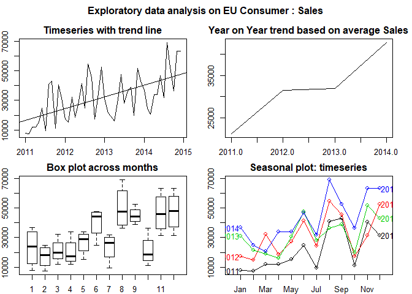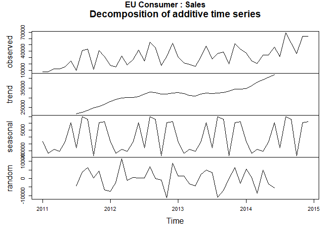

    ## [1] "Exploratory data analysis on EU Consumer : Quantity"
    ## [1] "ts"
    ## [1] 2011    1
    ## [1] 2014   12
    ## [1] 12
    ##    Min. 1st Qu.  Median    Mean 3rd Qu.    Max. 
    ##   134.0   242.5   398.0   407.1   518.0   932.0

    ##      Jan Feb Mar Apr May Jun Jul Aug Sep Oct Nov Dec
    ## 2011   1   2   3   4   5   6   7   8   9  10  11  12
    ## 2012   1   2   3   4   5   6   7   8   9  10  11  12
    ## 2013   1   2   3   4   5   6   7   8   9  10  11  12
    ## 2014   1   2   3   4   5   6   7   8   9  10  11  12

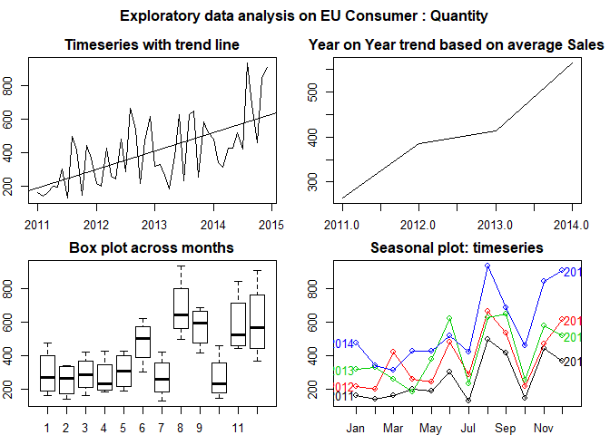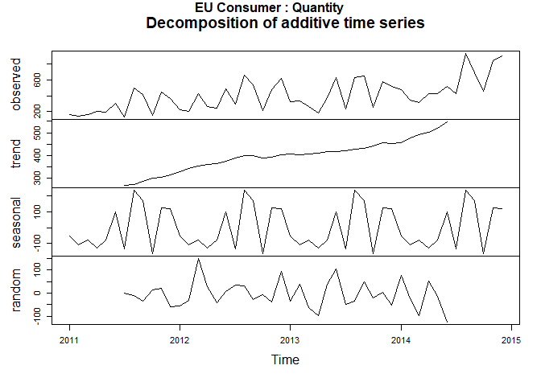

    ## [1] "Exploratory data analysis on APAC Consumer : Sales"
    ## [1] "ts"
    ## [1] 2011    1
    ## [1] 2014   12
    ## [1] 12
    ##    Min. 1st Qu.  Median    Mean 3rd Qu.    Max. 
    ##    8390   23765   36498   37849   49205   82286

    ##      Jan Feb Mar Apr May Jun Jul Aug Sep Oct Nov Dec
    ## 2011   1   2   3   4   5   6   7   8   9  10  11  12
    ## 2012   1   2   3   4   5   6   7   8   9  10  11  12
    ## 2013   1   2   3   4   5   6   7   8   9  10  11  12
    ## 2014   1   2   3   4   5   6   7   8   9  10  11  12

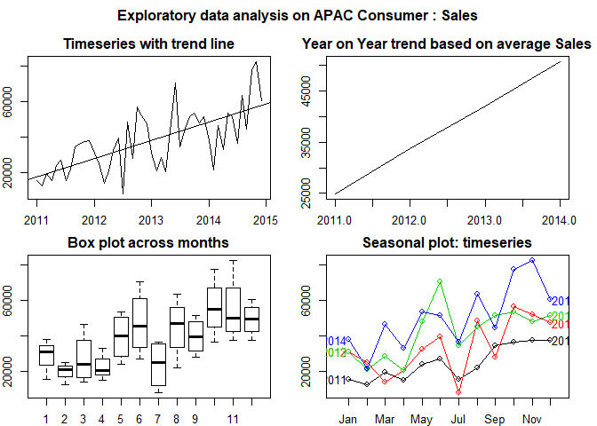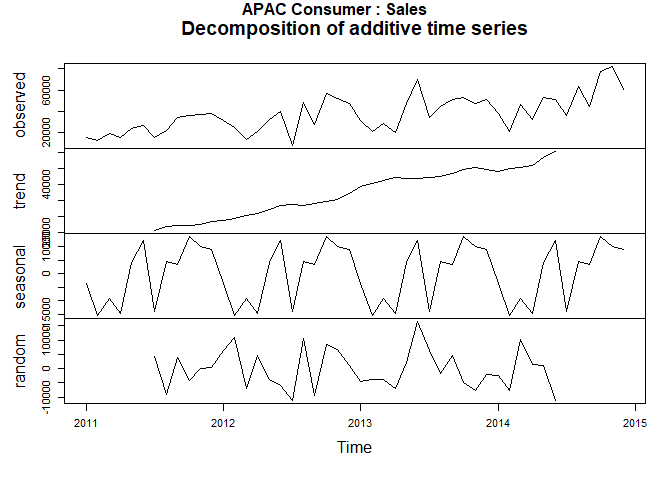

    ## [1] "Exploratory data analysis on APAC Consumer : Quantity"
    ## [1] "ts"
    ## [1] 2011    1
    ## [1] 2014   12
    ## [1] 12
    ##    Min. 1st Qu.  Median    Mean 3rd Qu.    Max. 
    ##   132.0   282.0   415.5   446.1   599.8   885.0

    ##      Jan Feb Mar Apr May Jun Jul Aug Sep Oct Nov Dec
    ## 2011   1   2   3   4   5   6   7   8   9  10  11  12
    ## 2012   1   2   3   4   5   6   7   8   9  10  11  12
    ## 2013   1   2   3   4   5   6   7   8   9  10  11  12
    ## 2014   1   2   3   4   5   6   7   8   9  10  11  12

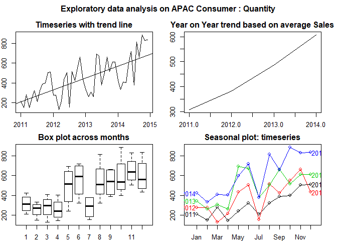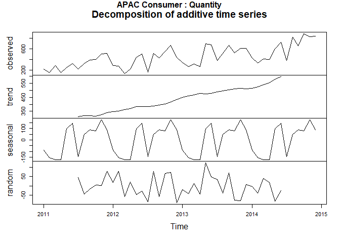

**Summary of findings from Exploratory data analysis:**

**Trend:**

-   EU Consumer - Sales/Demand increased in 2012 compared to 2011 and remained somewhat constant in 2013 and again started increasing reaching peak values in 2014.

-   APAC Consumer - Sales/Demand has steadily increased from the year 2011 to the year 2014.

**Seasonality from Box plot:**

-   EU Consumer - Higher Sales/Demand during Jun, Aug, Sep, Nov & Dec

-   APAC Consumer - Higher Sales/Demand during May, Jun, Aug through Dec

Model Building
--------------

``` r
EU.Consumer$Month <- seq(1,48)
APAC.Consumer$Month <- seq(1,48)
```

**Common functions**

Smoothen the time series using moving average method. The window selected is 3 i.e average of X - 1, X, X + 1 values

``` r
smoothenTS <- function(timeseries, w = 1){
  
  smseries <- stats::filter(timeseries, 
                            filter = rep(1/(2 * w + 1),(2 * w + 1)), 
                            method = 'convolution', sides = 2)
  
  # Smoothing left end of the time series
  diff <- smseries[w + 2] - smseries[w + 1]
  for (i in seq(w,1,-1)) {
    smseries[i] <- smseries[i + 1] - diff
  }
  
  # Smoothing right end of the time series
  n <- length(timeseries)
  diff <- smseries[n - w] - smseries[n - w - 1]
  for (i in seq(n - w + 1, n)) {
    smseries[i] <- smseries[i - 1] + diff
  }
  lines(smseries, col = "red", lwd = 2)
  return(smseries)
}
```

Exponential smoothing using HoltWinters method. Both Simple moving average and Exponential smoothing was tested and the former was selected for Model building

``` r
exposmoothenTS <- function(timeseries, alpha){
  
  cols <- c("red", "blue", "green", "black")
  labels <- c(paste("alpha =", alpha), "Original")
  for (i in seq(1,length(alpha))) {
    smseries <- HoltWinters(timeser, alpha = alpha[i],
                            beta = FALSE, gamma = FALSE)
    lines(fitted(smseries)[,1], col = cols[i], lwd = 2)
  }
  legend("bottomleft", labels, col = cols, lwd = 2)
}
```

The below function is to convert the passed dataframe into a Time Series object, plot and visualize it

``` r
convertTS  <- function(df, salesind) {
  indata <- df[1:42, ]
  if (salesind) { 
    timeser <- ts(indata$Sales)
    var = "Sales"
  } else {  
    timeser <- ts(indata$Quantity) 
    var = "Quantity"
  }
  plot(timeser, main = paste(deparse(substitute(df)),
                             ": ", var, "Time series" ),
       xlab = "Month", ylab = var)
  
  return(timeser)
}
```

**Classical decomposition - Model Building function**

Steps involved:

1.  Fit a model to the global Trend & Seasonality in the smoothened series using regression
2.  Remove Trend & Seasonality (the predicted values) from the series. to get a stationary time series(Autoregressive + white noise)
3.  Check for Stationarity using ACF & PACF plots
4.  Model the stationary series using the auto.arima() function
5.  Combine the forecast of this model with the trend and seasonal component
6.  Find the residual series by subtracting the forecasted value from the actual observed value.
7.  Check if the residual series is pure white noise using ADF & KPSS test.

``` r
buildModel <- function(timeser, smoothedseries, lmformula, var) {
  
  par(ask = T)
  # Building a model on the smoothed time series using classical decomposition
  # First, let's convert the time series to a dataframe
  
  timevals_in <- seq(1, 42)
  smootheddf <- as.data.frame(cbind(timevals_in, as.vector(smoothedseries)))
  colnames(smootheddf) <- c('Month', var)
  lmfit <- lm(lmformula, data = smootheddf)
  
  global_pred <- predict(lmfit, Month = timevals_in)
  summary(global_pred)
  lines(timevals_in, global_pred, col = 'green', lwd = 2)
  
  # Now, let's look at the locally predictable series
  # We will model it as an ARMA series
  local_pred <- timeser - global_pred
  plot(local_pred, col = 'red', type = "l", xlab = "Month", ylab = var, 
       main = "Local predictable Series")
  acf(local_pred)
  acf(local_pred, type = "partial")
  print(adf.test(local_pred,alternative = "stationary"))
  print(kpss.test(local_pred))
  # Series is not stationary
  armafit <- auto.arima(local_pred)
  armafit
  
  # We'll check if the residual series is white noise
  resi <- local_pred - fitted(armafit)
  acf(resi)
  acf(resi, type = "partial")
  print(adf.test(resi, alternative = "stationary"))
  print(kpss.test(resi))
  
  op <- par(mar = c(3.8,3.8,1.5,1.5))
  tsdiag(armafit)
  par(op)
  par(ask = F)
  return(lmfit)
}
```

**Model building steps:**

1.  Convert to Timeseries object
2.  Smoothen timeseries & Visualize by plotting
3.  Arrive at a formula for fitting the trend & Seasonality in the Series
4.  Call buildModel function

**EU Consumer Sales**

``` r
salesind = TRUE
timeser           <- convertTS(EU.Consumer, salesind)
```

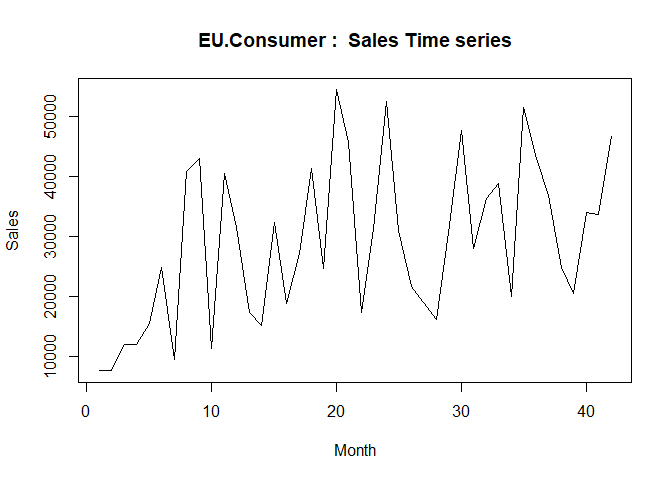

``` r
plot(timeser, main = "EU Consumer: Sales Fitted", 
     xlab = "Month", ylab = "Sales")
smoothedseries    <- smoothenTS(timeser, 1)
lmformula         <-  as.formula(Sales ~ sin(Month*0.60) * 
                                   cos(Month*0.60) *  poly(Month,3))
EU_Sales_model    <- buildModel(timeser, smoothedseries, lmformula, "Sales")
```

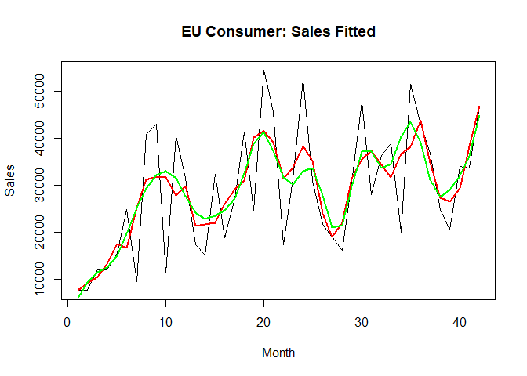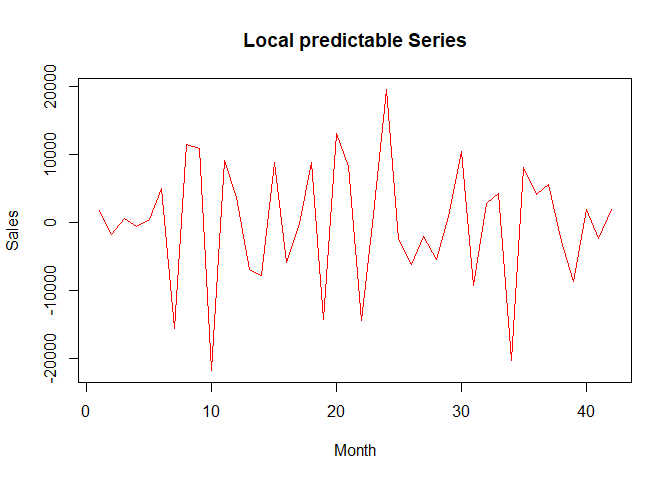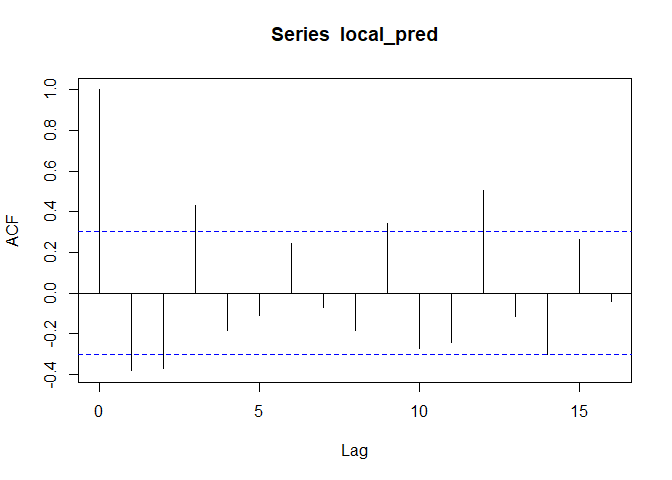

    ## Warning in adf.test(local_pred, alternative = "stationary"): p-value
    ## smaller than printed p-value

    ## 
    ##  Augmented Dickey-Fuller Test
    ## 
    ## data:  local_pred
    ## Dickey-Fuller = -5.0693, Lag order = 3, p-value = 0.01
    ## alternative hypothesis: stationary

    ## Warning in kpss.test(local_pred): p-value greater than printed p-value

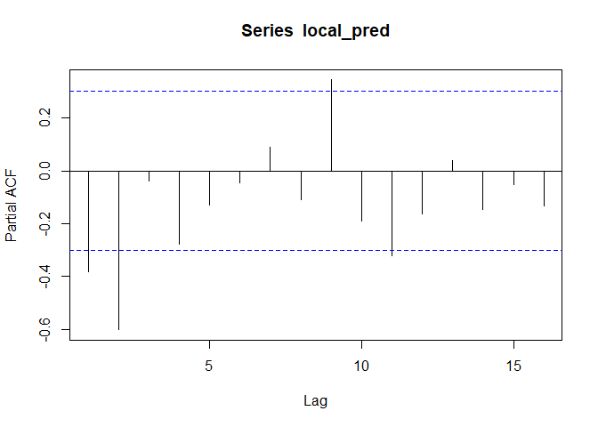

    ## 
    ##  KPSS Test for Level Stationarity
    ## 
    ## data:  local_pred
    ## KPSS Level = 0.023684, Truncation lag parameter = 1, p-value = 0.1

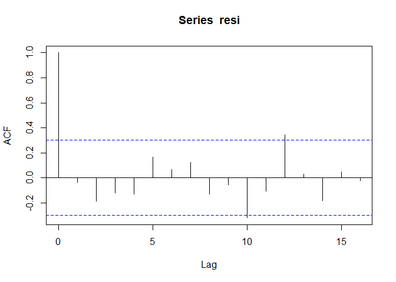

    ## 
    ##  Augmented Dickey-Fuller Test
    ## 
    ## data:  resi
    ## Dickey-Fuller = -4.1723, Lag order = 3, p-value = 0.0124
    ## alternative hypothesis: stationary

    ## Warning in kpss.test(resi): p-value greater than printed p-value

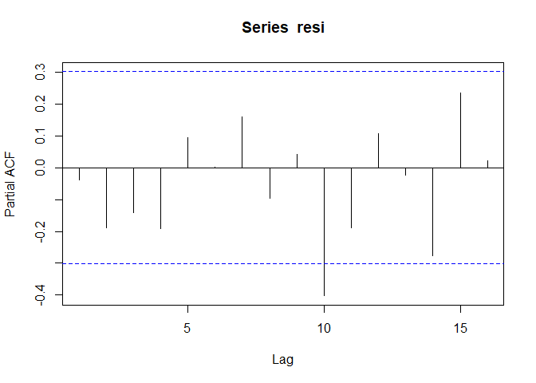

    ## 
    ##  KPSS Test for Level Stationarity
    ## 
    ## data:  resi
    ## KPSS Level = 0.059803, Truncation lag parameter = 1, p-value = 0.1

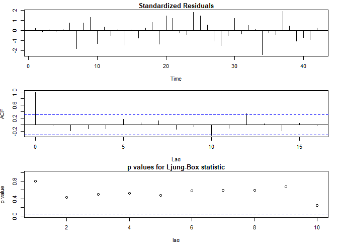

The following test results indicates the resulting residual series is stationary ADF test - 0.01 KPSS test - 0.1

**APAC Consumer Sales**

``` r
salesind = TRUE
timeser           <- convertTS(APAC.Consumer, salesind) 
```

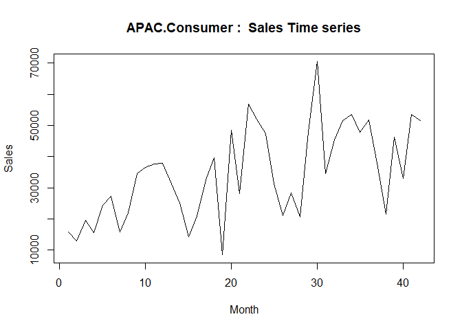

``` r
plot(timeser, main = "APAC Consumer: Sales Fitted", 
     xlab = "Month", ylab = "Sales")
smoothedseries    <- smoothenTS(timeser, 1)
lmformula         <-  as.formula(Sales ~ sin(Month*0.50) * 
                                   cos(Month*0.50) + Month)
APAC_Sales_model  <- buildModel(timeser, smoothedseries, lmformula, "Sales")  
```

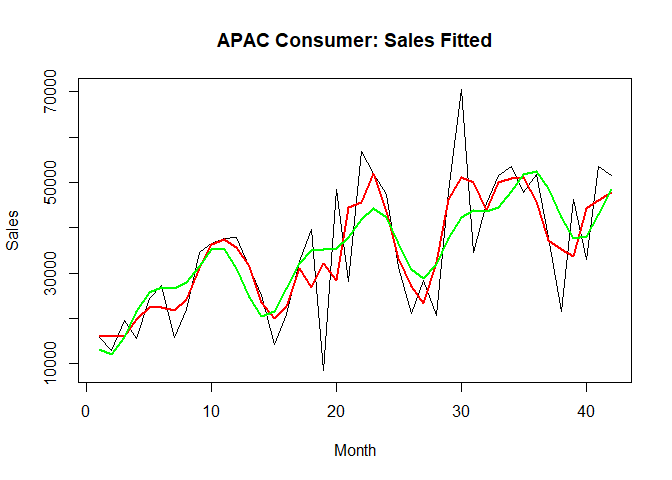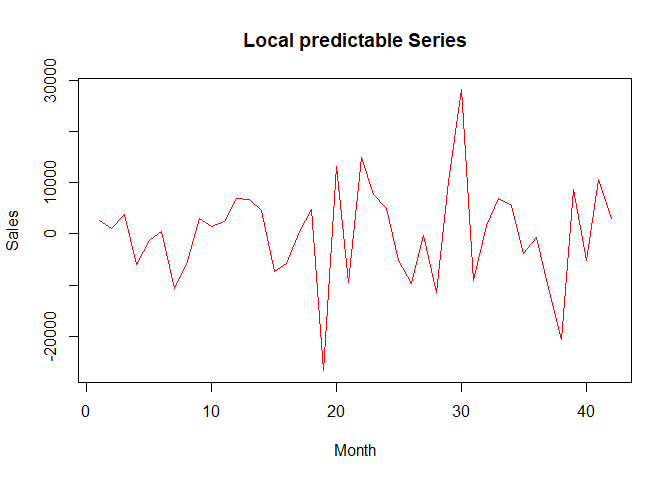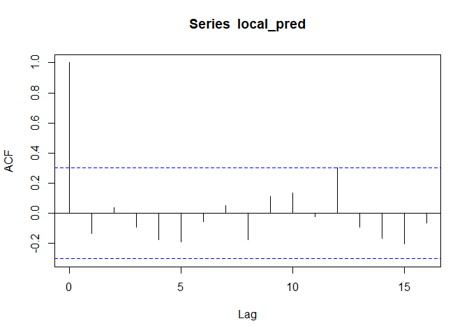

    ## 
    ##  Augmented Dickey-Fuller Test
    ## 
    ## data:  local_pred
    ## Dickey-Fuller = -3.7419, Lag order = 3, p-value = 0.03381
    ## alternative hypothesis: stationary

    ## Warning in kpss.test(local_pred): p-value greater than printed p-value

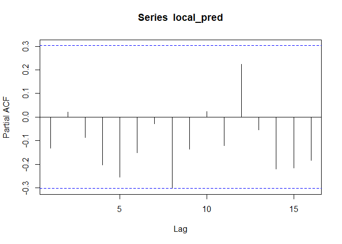

    ## 
    ##  KPSS Test for Level Stationarity
    ## 
    ## data:  local_pred
    ## KPSS Level = 0.039685, Truncation lag parameter = 1, p-value = 0.1

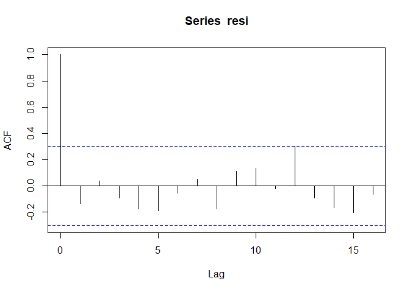

    ## 
    ##  Augmented Dickey-Fuller Test
    ## 
    ## data:  resi
    ## Dickey-Fuller = -3.7419, Lag order = 3, p-value = 0.03381
    ## alternative hypothesis: stationary

    ## Warning in kpss.test(resi): p-value greater than printed p-value

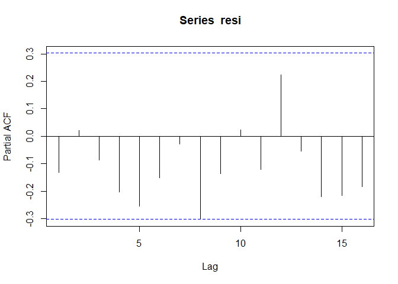

    ## 
    ##  KPSS Test for Level Stationarity
    ## 
    ## data:  resi
    ## KPSS Level = 0.039685, Truncation lag parameter = 1, p-value = 0.1

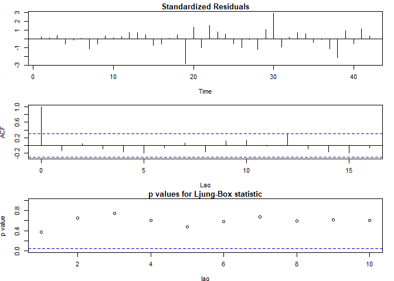

The following test results indicates the resulting residual series is stationary ADF test - 0.01 KPSS test - 0.1

**EU Consumer Quantity**

``` r
salesind = FALSE
timeser           <- convertTS(EU.Consumer, salesind) 
```

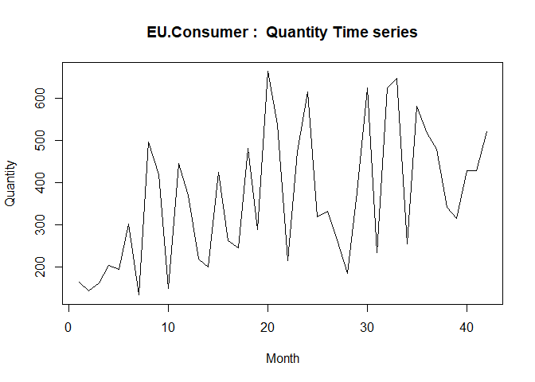

``` r
plot(timeser, main = "EU Consumer: Demand Fitted", 
     xlab = "Month", ylab = "Demand")
smoothedseries    <- smoothenTS(timeser, 1)
lmformula         <-  as.formula(Quantity ~ sin(Month*0.60) * 
                                   cos(Month*0.60) *  poly(Month,3))
EU_Demand_model   <- buildModel(timeser, smoothedseries, lmformula, "Quantity")
```

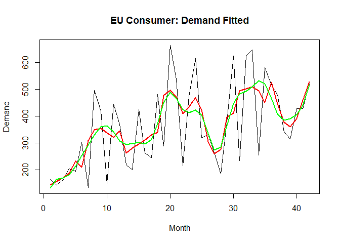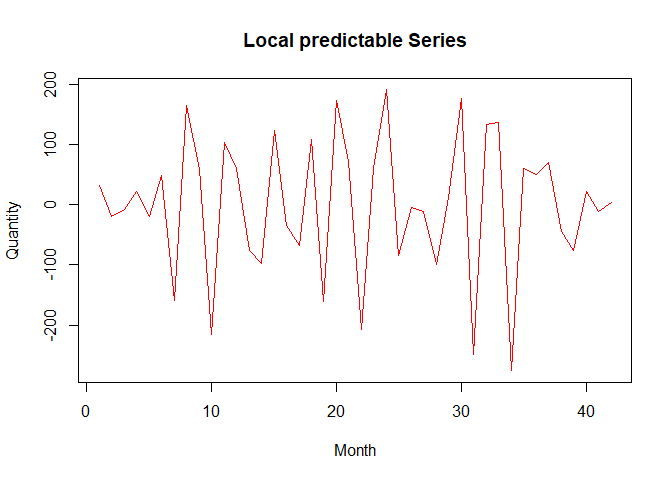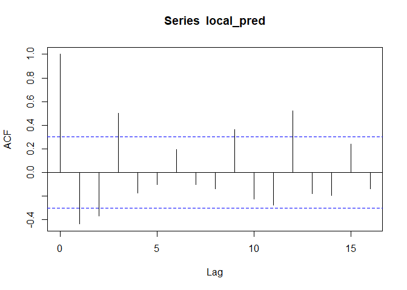

    ## Warning in adf.test(local_pred, alternative = "stationary"): p-value
    ## smaller than printed p-value

    ## 
    ##  Augmented Dickey-Fuller Test
    ## 
    ## data:  local_pred
    ## Dickey-Fuller = -6.122, Lag order = 3, p-value = 0.01
    ## alternative hypothesis: stationary

    ## Warning in kpss.test(local_pred): p-value greater than printed p-value

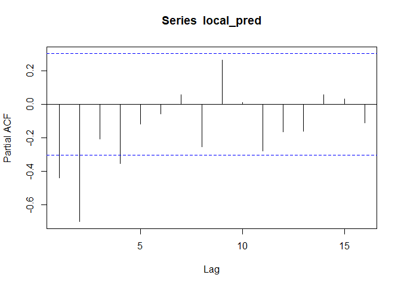

    ## 
    ##  KPSS Test for Level Stationarity
    ## 
    ## data:  local_pred
    ## KPSS Level = 0.019452, Truncation lag parameter = 1, p-value = 0.1

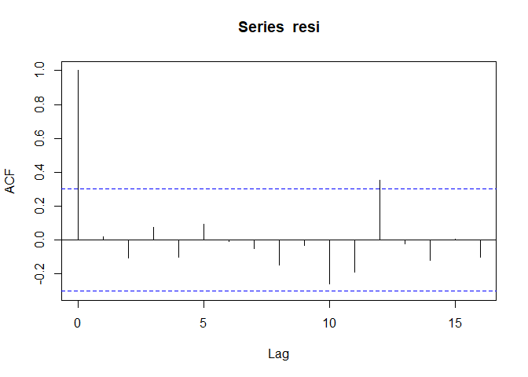

    ## 
    ##  Augmented Dickey-Fuller Test
    ## 
    ## data:  resi
    ## Dickey-Fuller = -3.0505, Lag order = 3, p-value = 0.1596
    ## alternative hypothesis: stationary

    ## Warning in kpss.test(resi): p-value greater than printed p-value

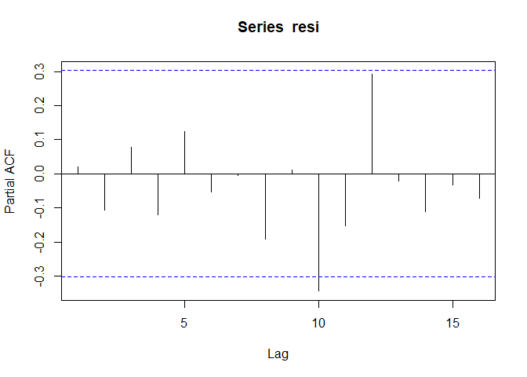

    ## 
    ##  KPSS Test for Level Stationarity
    ## 
    ## data:  resi
    ## KPSS Level = 0.092988, Truncation lag parameter = 1, p-value = 0.1

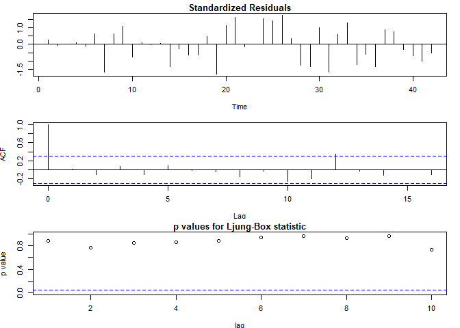

The following test results indicates the final resulting residual series is stationary ADF test - 0.01 KPSS test - 0.1

**APAC Consumer Quantity**

``` r
salesind = FALSE
timeser           <- convertTS(APAC.Consumer, salesind) 
```

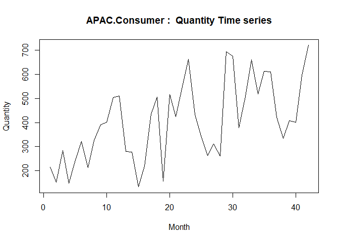

``` r
plot(timeser, main = "APAC Consumer: Demand Fitted", 
     xlab = "Month", ylab = "Demand")
smoothedseries    <- smoothenTS(timeser, 1)
lmformula         <-  as.formula(Quantity ~ sin(Month*0.5) * 
                                   cos(Month*0.5) + poly(Month, 2))
APAC_Demand_model <- buildModel(timeser, smoothedseries, lmformula, "Quantity")  
```

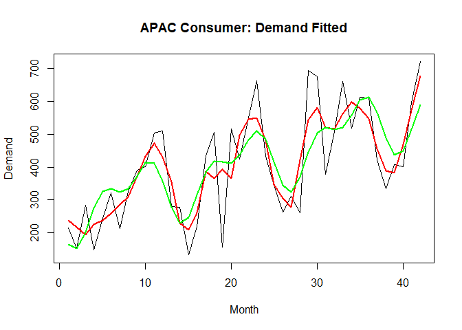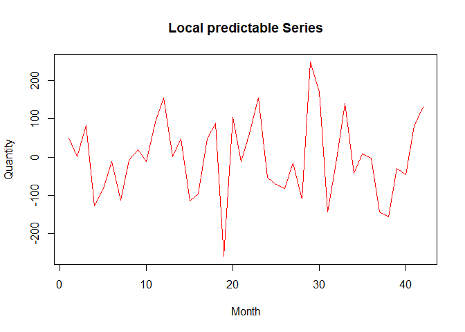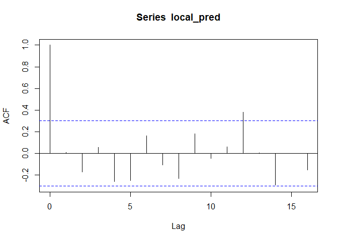

    ## 
    ##  Augmented Dickey-Fuller Test
    ## 
    ## data:  local_pred
    ## Dickey-Fuller = -3.9291, Lag order = 3, p-value = 0.02203
    ## alternative hypothesis: stationary

    ## Warning in kpss.test(local_pred): p-value greater than printed p-value

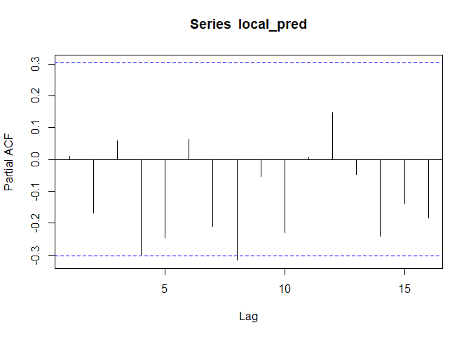

    ## 
    ##  KPSS Test for Level Stationarity
    ## 
    ## data:  local_pred
    ## KPSS Level = 0.034365, Truncation lag parameter = 1, p-value = 0.1

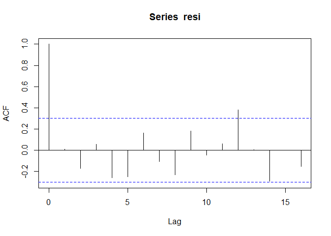

    ## 
    ##  Augmented Dickey-Fuller Test
    ## 
    ## data:  resi
    ## Dickey-Fuller = -3.9291, Lag order = 3, p-value = 0.02203
    ## alternative hypothesis: stationary

    ## Warning in kpss.test(resi): p-value greater than printed p-value

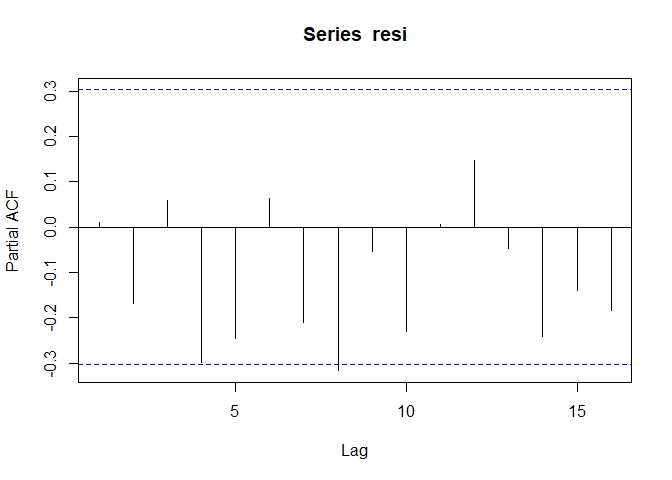

    ## 
    ##  KPSS Test for Level Stationarity
    ## 
    ## data:  resi
    ## KPSS Level = 0.034365, Truncation lag parameter = 1, p-value = 0.1

 The following test results indicates the resulting residual series is stationary ADF test - 0.01 KPSS test - 0.1

Model Evaluation
----------------

Model evaluation function to predict for last 6 months and comparing against actuals using MAPE metric

``` r
evaluateModel <- function(df, fittedmodel, salesind){
  # Let's evaluate the model using MAPE
  outdata <- df[43:48,] 
  timevals_out <-  data.frame(Month = outdata$Month)
  fcast_arima <- predict(fittedmodel, timevals_out)
  print(fcast_arima)
  if (salesind)
    MAPE_arima <- accuracy(fcast_arima, outdata$Sales)[5]
  else 
    MAPE_arima <- accuracy(fcast_arima, outdata$Quantity)[5]
  return(MAPE_arima)
}
```

**Auto Arima model building and evaluation**

``` r
autoArima     <- function(df, salesind) {
  indata <- df[1:42,]
  if (salesind) { 
    timeser       <- ts(indata$Sales)
    total_timeser <- ts(df$Sales)
    var = "Sales"
  } else {  
    timeser       <- ts(indata$Quantity) 
    total_timeser <- ts(df$Quantity)
    var = "Quantity"
  }
  
  auto_arima_model <- auto.arima(timeser)
  print(auto_arima_model)
  op <- par(mar = c(3.8,3.8,1.5,1.5))
  tsdiag(auto_arima_model)
  par(op)
  plot(auto_arima_model$x, col = "black", 
       main = "Auto ARIMA model fitted",
       xlab = "Month", ylab = var)
  
  lines(fitted(auto_arima_model), col = "red")
  
  #Again, let's check if the residual series is white noise
  resi_auto_arima <- timeser - fitted(auto_arima_model)
  
  adf.test(resi_auto_arima, alternative = "stationary")
  kpss.test(resi_auto_arima)
  
  #Also, let's evaluate the model using MAPE
  fcast_auto_arima <- predict(auto_arima_model, n.ahead = 6)
  print(fcast_auto_arima)
  outdata <- df[43:48,] 
  if (salesind)
    MAPE_auto_arima <- accuracy(fcast_auto_arima$pred,outdata$Sales)[5]
  else 
    MAPE_auto_arima <- accuracy(fcast_auto_arima$pred,outdata$Quantity)[5]
  
  
  #Lastly, let's plot the predictions along with original values, to
  #get a visual feel of the fit
  auto_arima_pred <- c(fitted(auto_arima_model), ts(fcast_auto_arima$pred))
  plot(total_timeser, col = "black", main = "Auto ARIMA model forecast",
       xlab = "Month", ylab = var)
  lines(auto_arima_pred, col = "red", lwd = 2)
  #title = paste("Auto Arima model", deparse(substitute(df)), ":", var)
  return(MAPE_auto_arima)
} 
```

**EU Consumer Sales**

``` r
MAPE_results <-  data.frame()
salesind = TRUE
MAPE_results["EU_Sales", "CD_MAPE"]           <- 
  evaluateModel(EU.Consumer, EU_Sales_model, salesind)
```

    ##        1        2        3        4        5        6 
    ## 55965.73 59967.19 53033.26 46781.88 55095.88 72025.72

``` r
MAPE_results["EU_Sales", "Auto_ARIMA_MAPE"]   <- 
  autoArima(EU.Consumer, salesind)
```

    ## Series: timeser 
    ## ARIMA(2,1,0) 
    ## 
    ## Coefficients:
    ##           ar1      ar2
    ##       -0.5796  -0.4906
    ## s.e.   0.1346   0.1310
    ## 
    ## sigma^2 estimated as 168564623:  log likelihood=-445.84
    ## AIC=897.67   AICc=898.32   BIC=902.81

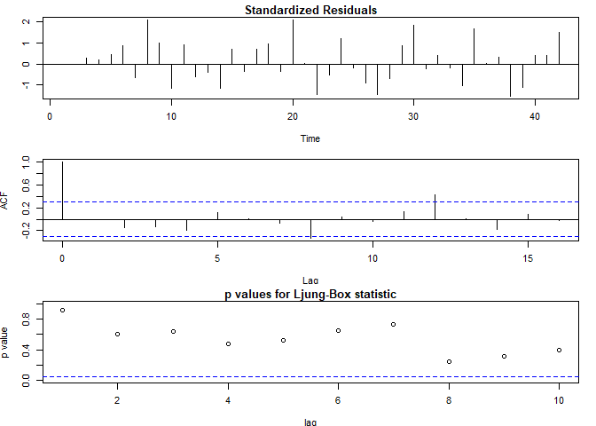

    ## Warning in adf.test(resi_auto_arima, alternative = "stationary"): p-value
    ## smaller than printed p-value

    ## Warning in kpss.test(resi_auto_arima): p-value greater than printed p-value

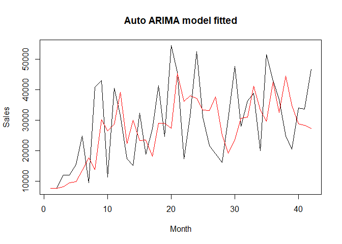

    ## $pred
    ## Time Series:
    ## Start = 43 
    ## End = 48 
    ## Frequency = 1 
    ## [1] 39297.86 37221.06 42062.87 40275.32 38936.08 40589.28
    ## 
    ## $se
    ## Time Series:
    ## Start = 43 
    ## End = 48 
    ## Frequency = 1 
    ## [1] 12983.24 14083.80 14500.28 16710.60 17921.71 18648.29

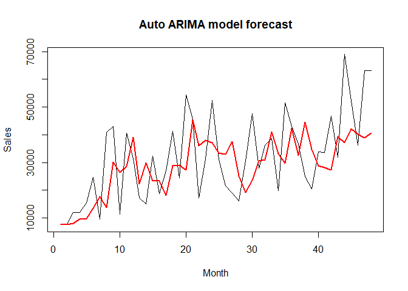

**APAC Consumer Sales**

``` r
salesind = TRUE
MAPE_results["APAC_Sales", "CD_MAPE"]          <- 
  evaluateModel(APAC.Consumer, APAC_Sales_model, salesind)
```

    ##        1        2        3        4        5        6 
    ## 51775.86 52192.08 52202.86 54287.98 58243.78 61102.96

``` r
MAPE_results["APAC_Sales", "Auto_ARIMA_MAPE"]  <- 
  autoArima(APAC.Consumer, salesind) 
```

    ## Series: timeser 
    ## ARIMA(0,1,1) 
    ## 
    ## Coefficients:
    ##           ma1
    ##       -0.7559
    ## s.e.   0.1381
    ## 
    ## sigma^2 estimated as 174361555:  log likelihood=-447.11
    ## AIC=898.23   AICc=898.55   BIC=901.66


    ## Warning in adf.test(resi_auto_arima, alternative = "stationary"): p-value
    ## smaller than printed p-value

    ## Warning in kpss.test(resi_auto_arima): p-value greater than printed p-value

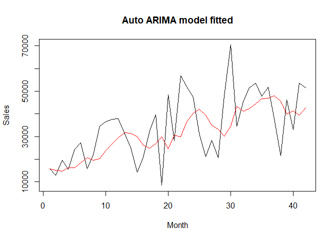

    ## $pred
    ## Time Series:
    ## Start = 43 
    ## End = 48 
    ## Frequency = 1 
    ## [1] 44898.7 44898.7 44898.7 44898.7 44898.7 44898.7
    ## 
    ## $se
    ## Time Series:
    ## Start = 43 
    ## End = 48 
    ## Frequency = 1 
    ## [1] 13204.60 13592.40 13969.43 14336.56 14694.51 15043.95

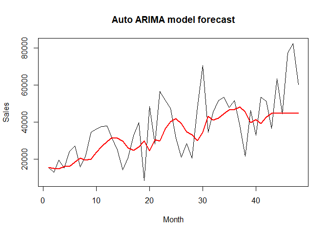

**EU Consumer Quantity**

``` r
salesind = FALSE
MAPE_results["EU_Quantity", "CD_MAPE"]          <- 
  evaluateModel(EU.Consumer, EU_Demand_model, salesind)
```

    ##        1        2        3        4        5        6 
    ## 605.3052 634.8338 597.9299 594.2603 710.4786 871.8647

``` r
MAPE_results["EU_Quantity", "Auto_ARIMA_MAPE"]  <- 
  autoArima(EU.Consumer, salesind)
```

    ## Series: timeser 
    ## ARIMA(2,1,0) 
    ## 
    ## Coefficients:
    ##           ar1      ar2
    ##       -0.7359  -0.5879
    ## s.e.   0.1224   0.1185
    ## 
    ## sigma^2 estimated as 21185:  log likelihood=-261.9
    ## AIC=529.8   AICc=530.44   BIC=534.94

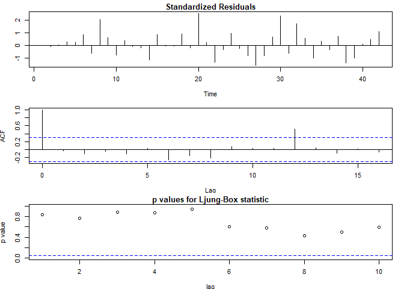

    ## Warning in kpss.test(resi_auto_arima): p-value greater than printed p-value

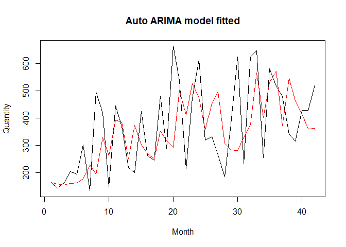

    ## $pred
    ## Time Series:
    ## Start = 43 
    ## End = 48 
    ## Frequency = 1 
    ## [1] 452.7129 448.8772 491.8447 462.4816 458.8288 478.7789
    ## 
    ## $se
    ## Time Series:
    ## Start = 43 
    ## End = 48 
    ## Frequency = 1 
    ## [1] 145.5500 150.5419 153.8418 183.2835 190.9621 196.7892

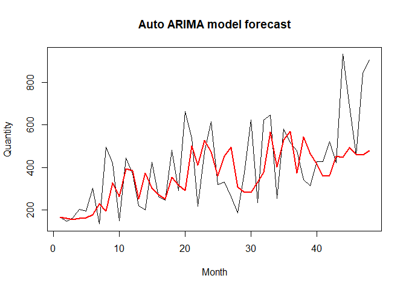

**APAC Consumer Quantity**

``` r
salesind = FALSE
MAPE_results["APAC_Quantity", "CD_MAPE"]         <- 
  evaluateModel(APAC.Consumer, APAC_Demand_model, salesind)
```

    ##        1        2        3        4        5        6 
    ## 631.6447 634.6755 630.9772 653.4315 700.7992 736.3651

``` r
MAPE_results["APAC_Quantity", "Auto_ARIMA_MAPE"] <- 
  autoArima(APAC.Consumer, salesind)
```

    ## Series: timeser 
    ## ARIMA(0,1,0) 
    ## 
    ## sigma^2 estimated as 25366:  log likelihood=-266.07
    ## AIC=534.14   AICc=534.24   BIC=535.85

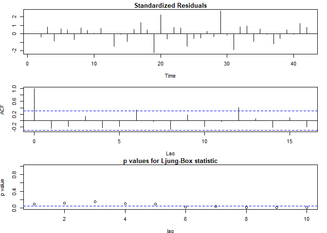

    ## Warning in adf.test(resi_auto_arima, alternative = "stationary"): p-value
    ## smaller than printed p-value

    ## Warning in kpss.test(resi_auto_arima): p-value greater than printed p-value

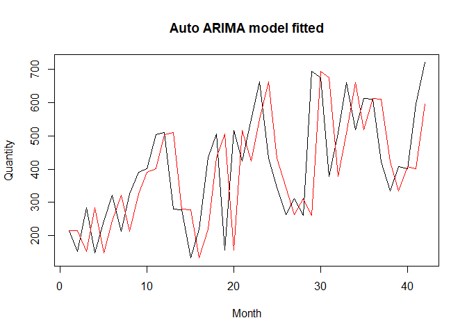

    ## $pred
    ## Time Series:
    ## Start = 43 
    ## End = 48 
    ## Frequency = 1 
    ## [1] 721 721 721 721 721 721
    ## 
    ## $se
    ## Time Series:
    ## Start = 43 
    ## End = 48 
    ## Frequency = 1 
    ## [1] 159.2675 225.2382 275.8593 318.5349 356.1329 390.1240

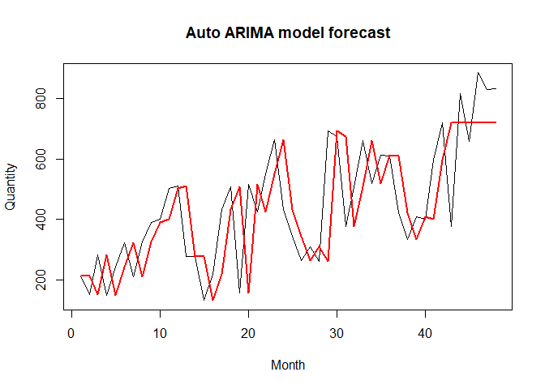

Display MAPE values

``` r
print("MAPE values using Classical decomp. & Auto Arima model: ")
```

    ## [1] "MAPE values using Classical decomp. & Auto Arima model: "

``` r
print(MAPE_results)
```

    ##                CD_MAPE Auto_ARIMA_MAPE
    ## EU_Sales      24.16714        28.92260
    ## APAC_Sales    22.89470        27.68952
    ## EU_Quantity   22.82076        30.13319
    ## APAC_Quantity 24.51737        26.24458

Final Summary
-------------

Top 2 consistently profitable Market segments based on Coeff. of Variation

1.  EU-Consumer
2.  APAC-Consumer

**MAPE values** for all 4 Market segment buckets using Classical Decomposition model & Auto Arima model:

| Market Segment | CD MAPE  | Auto ARIMA MAPE |
|----------------|----------|-----------------|
| EU\_Sales      | 24.16714 | 28.92260        |
| APAC\_Sales    | 22.89470 | 27.68952        |
| EU\_Quantity   | 22.82076 | 30.13319        |
| APAC\_Quantity | 24.51737 | 26.24458        |

**Actual vs Forecast for last 6 Months in 2014: **

1.EU Consumer Sales

| Month    | Jul.2014 | Aug.2014 | Sep.2014 | Oct.2014 | Nov.2014 | Dec.2014 |
|----------|----------|----------|----------|----------|----------|----------|
| Actuals  | 31967.69 | 68951.72 | 52328.68 | 36348.31 | 63218.71 | 63178.60 |
| Forecast | 55965.73 | 59967.19 | 53033.26 | 46781.88 | 55095.88 | 72025.72 |

2.EU Consumer Demand

| Month    | Jul.2014 | Aug.2014 | Sep.2014 | Oct.2014 | Nov.2014 | Dec.2014 |
|----------|----------|----------|----------|----------|----------|----------|
| Actuals  | 423      | 932      | 688      | 459      | 843      | 905      |
| Forecast | 605      | 635      | 598      | 594      | 710      | 872      |

3.APAC Consumer Sales

| Month    | Jul.2014 | Aug.2014 | Sep.2014 | Oct.2014 | Nov.2014 | Dec.2014 |
|----------|----------|----------|----------|----------|----------|----------|
| Actuals  | 36524.30 | 63521.77 | 44477.27 | 77379.83 | 82286.36 | 60292.13 |
| Forecast | 51775.86 | 52192.08 | 52202.86 | 54287.98 | 58243.78 | 61102.96 |

4.APAC Consumer Demand

| Month    | Jul.2014 | Aug.2014 | Sep.2014 | Oct.2014 | Nov.2014 | Dec.2014 |
|----------|----------|----------|----------|----------|----------|----------|
| Actuals  | 377      | 816      | 658      | 885      | 829      | 833      |
| Forecast | 632      | 635      | 631      | 653      | 701      | 736      |
